# ✅ STIG Remediation Process: WN10-00-000155

**STIG ID:** WN10-00-000155

**Status:** ✅ Completed

## 🧾 Personal Implementation Notes

This document outlines the exact step-by-step process I followed to manually and programmatically remediate STIG **WN10-00-000155** on a Windows 10 virtual machine. Each stage includes screenshots, testing steps, and a PowerShell script I created based on STIG guidance.

---

## 🔍 Initial Assessment

* Identified **WN10-00-000155** as failed in the initial Tenable STIG scan.

* Confirmed the baseline scan used correct DISA STIG benchmark (Windows 10 v3r1).

* **Description:**
  `Windows PowerShell 2.0 must be disabled on the system.`
  PowerShell 2.0 is outdated and lacks modern security features. It should be disabled to reduce attack surface.

* 📸 Screenshot: Initial failed scan
  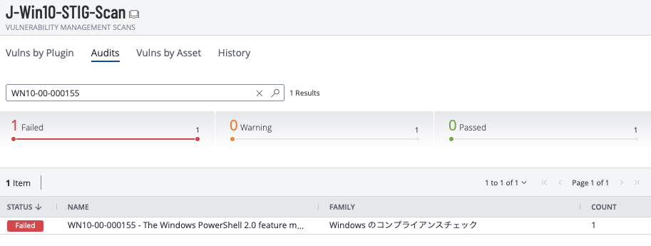

---

## 🛠 Manual Remediation

* Researched manual fix using:

  * [STIG-A-VIEW WN10-00-000155](https://stigaview.com/products/win10/v3r1/WN10-00-000155/)
    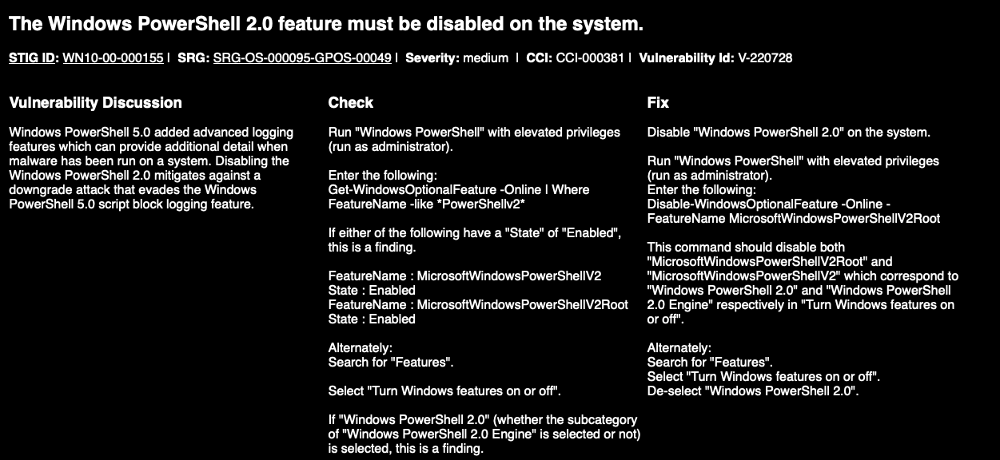

* Manual Fix Steps:

  1. Open **Windows Features**
  

  2. Locate **Windows PowerShell 2.0**
  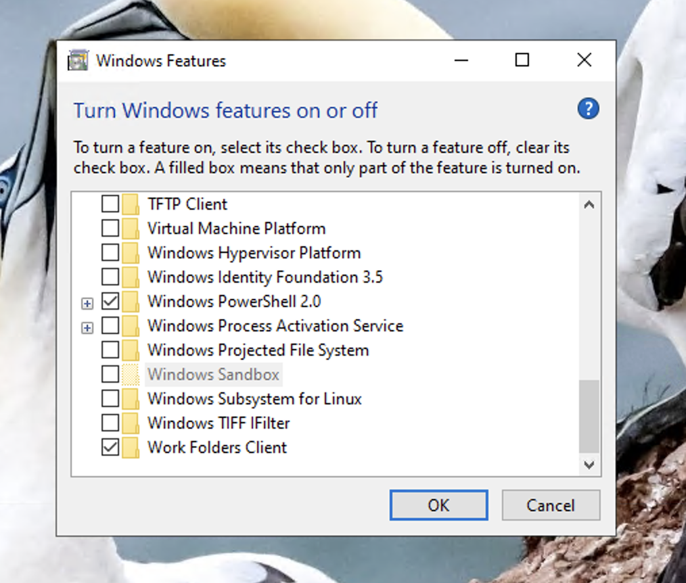
  
  3. Uncheck the feature (turn off)
  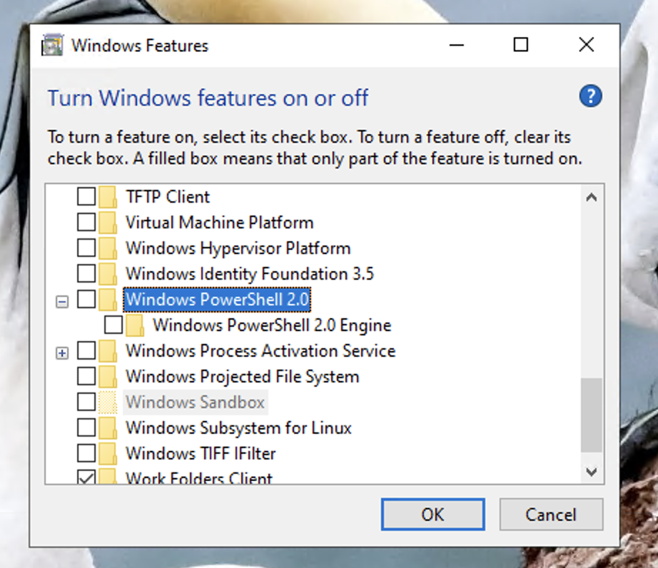 
     
  4. Click **OK** and allow Windows to apply changes
  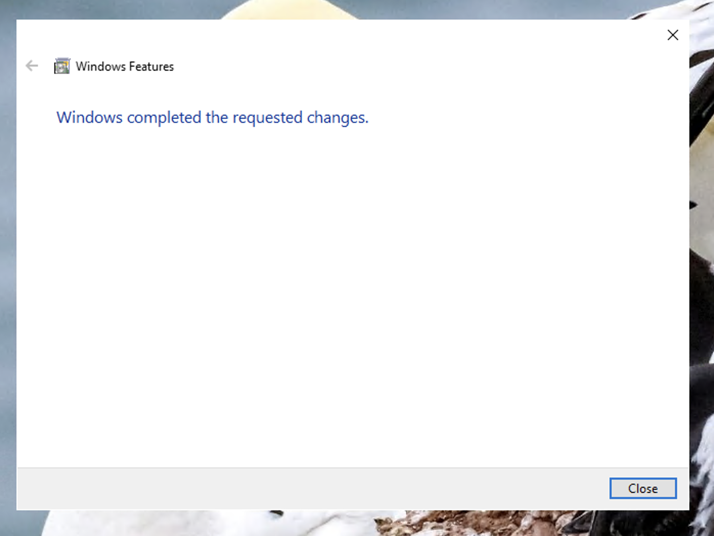 
  
  5. Restarted the system 

* 📸 Screenshot: Scan results after manual remediation — **Passed**
  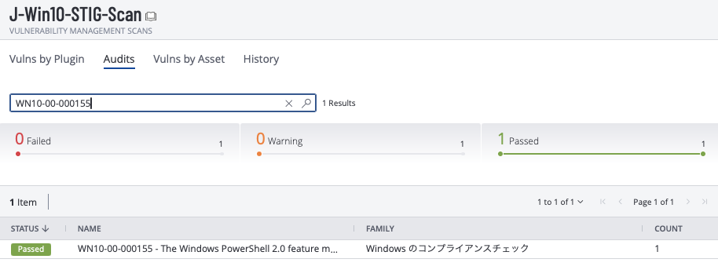

---

## 🔁 Revert & Recheck

* Reversed the setting to simulate noncompliance:

  * Re-enabled **Windows PowerShell 2.0** in Windows Features
  

  * Applied and completed change
  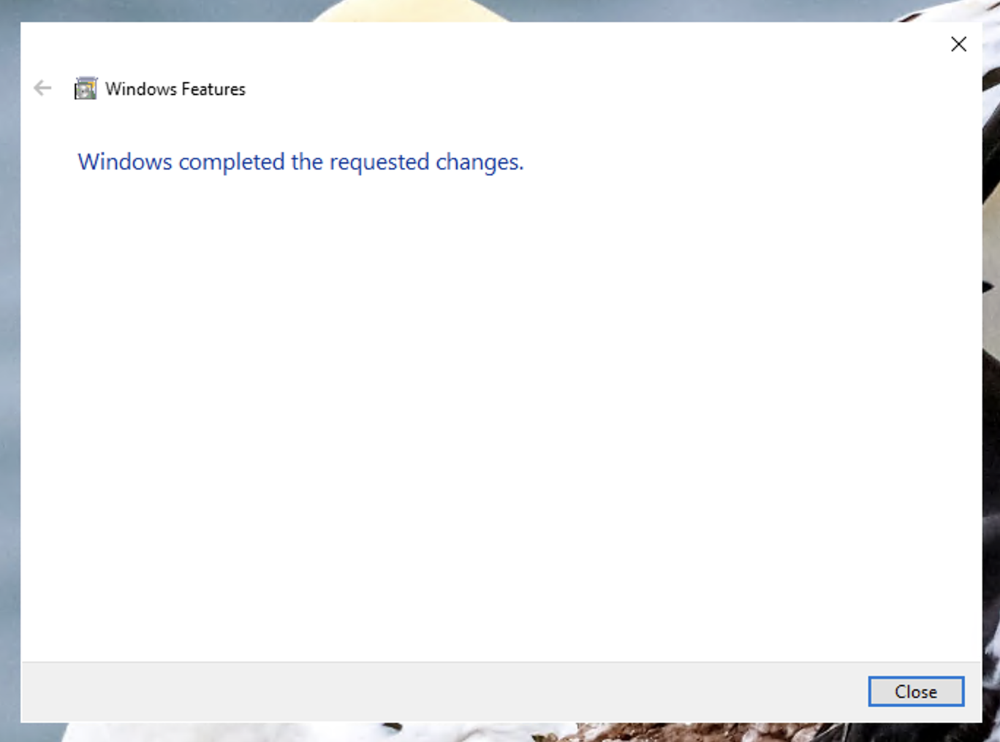

* Restarted VM

* 📸 Screenshot: Scan result after revert — **Failed**
  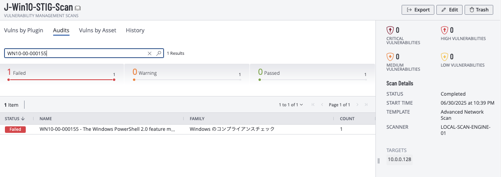

---

## ⚡ PowerShell Remediation

* PowerShell fix was provided in STIG-A-VIEW, but I created my own version for practice using ChatGPT:

```powershell
<#
.SYNOPSIS
    Disables Windows PowerShell 2.0 and its engine to prevent downgrade attacks.

.DESCRIPTION
    Implements STIG control WN10-00-000155 by disabling:
    - MicrosoftWindowsPowerShellV2Root
    - MicrosoftWindowsPowerShellV2

    This mitigates downgrade attacks that bypass PowerShell 5.x logging features.

.NOTES
    Author          : Jason Nguyen
    GitHub          : github.com/jason-p-nguyen
    Date Created    : 2025-06-30
    Last Modified   : 2025-06-30
    Version         : 1.0
    CVEs            : N/A
    Plugin IDs      : N/A
    STIG-ID         : WN10-00-000155

.TESTED ON
    Date(s) Tested  : 2025-06-30
    Tested By       : Jason Nguyen
    Systems Tested  : Microsoft Windows 10 [Version 10.0.19045.2965]
    PowerShell Ver. : 5.1.19041.2965

.USAGE
    Run this script in an elevated PowerShell session (Run as Administrator)
#>

# List of optional features to disable
$featuresToDisable = @(
    "MicrosoftWindowsPowerShellV2Root",
    "MicrosoftWindowsPowerShellV2"
)

foreach ($feature in $featuresToDisable) {
    $state = Get-WindowsOptionalFeature -Online -FeatureName $feature

    if ($state.State -eq "Enabled") {
        Write-Host "[INFO] Disabling feature: $feature ..."
        Disable-WindowsOptionalFeature -Online -FeatureName $feature -NoRestart -ErrorAction SilentlyContinue

        $newState = Get-WindowsOptionalFeature -Online -FeatureName $feature
        if ($newState.State -ne "Enabled") {
            Write-Host "[SUCCESS] Feature '$feature' disabled successfully." -ForegroundColor Green
        } else {
            Write-Host "[WARNING] Failed to disable '$feature'. Check manually." -ForegroundColor Yellow
        }
    } else {
        Write-Host "[OK] Feature '$feature' is already disabled." -ForegroundColor Cyan
    }
}

Write-Host "`n[NOTE] A reboot may be required for the change to fully take effect." -ForegroundColor Yellow
```

* 📸 Screenshot: PowerShell script executed
  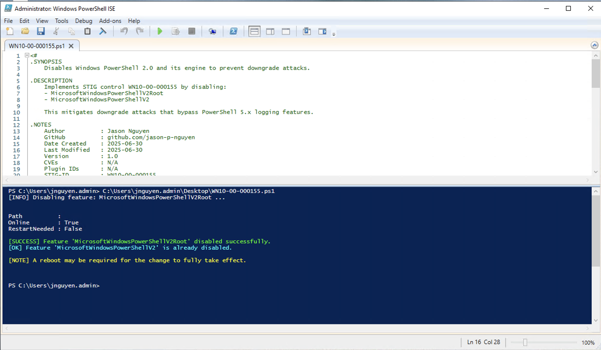

* 📸 Screenshot: Manual check — PowerShell 2.0 turned off in Windows Features
  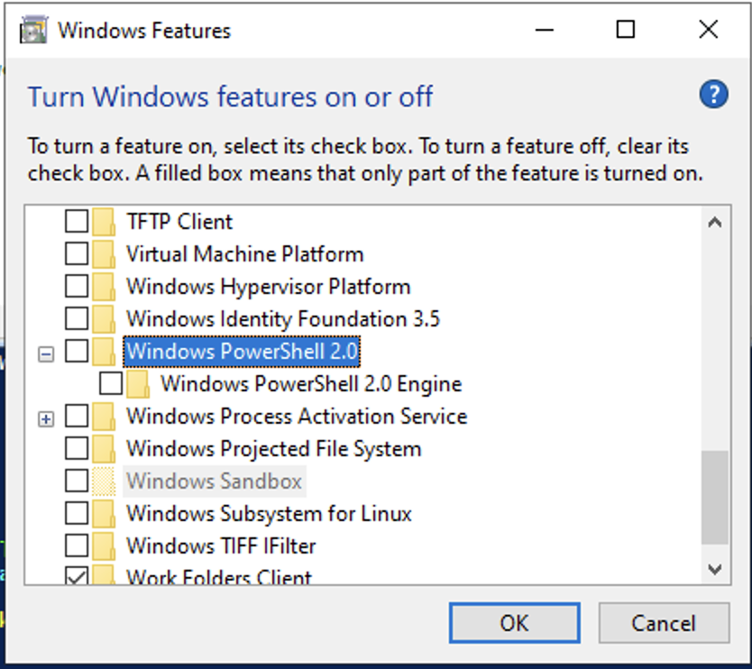

* Restarted VM

* 📸 Screenshot: Scan result after PowerShell remediation — **Passed**
  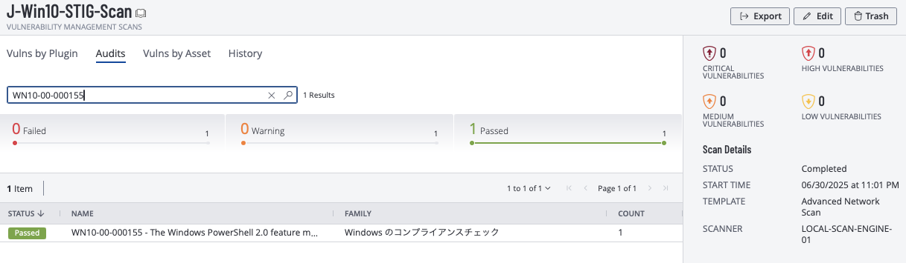

---

## 📦 Documentation for GitHub

* Markdown documentation completed
* Uploaded:

  * Screenshots of manual, revert, and PowerShell remediation
  * PowerShell script with full header and inline notes
* Added STIG link:
  [DISA STIG Viewer - WN10-00-000155](https://stigaview.com/products/win10/v3r1/WN10-00-000155/)
* GitHub README updated
* ✅ Marked complete in internship tracker

---

## 🧠 Reflection

* Learned how to manage optional features via both GUI and PowerShell.
* This STIG was straightforward but emphasized the importance of removing deprecated tools.
* Practiced validating a STIG fix through full remediation lifecycle.
* Reinforced comfort with script creation, documentation, and manual feature toggling.
* ✅ Successfully completed and documented for reuse.
