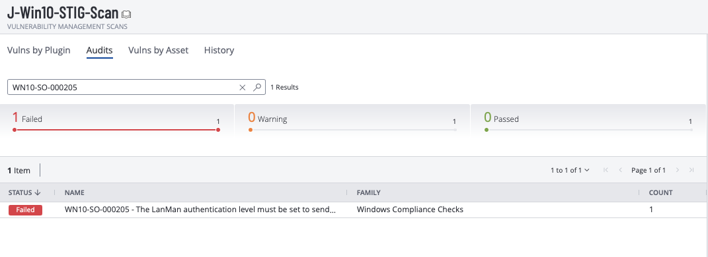
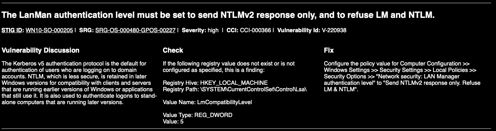
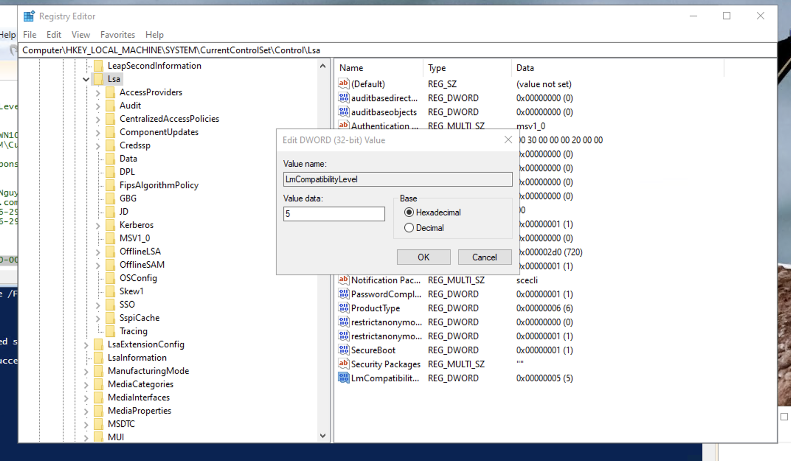
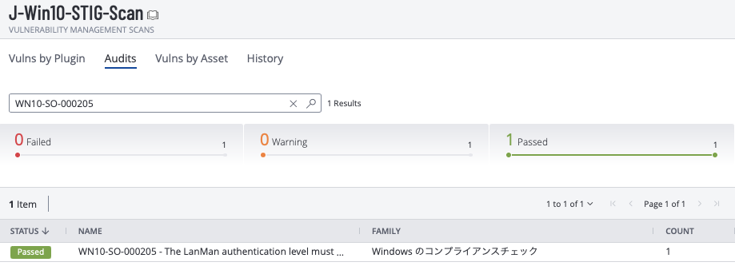
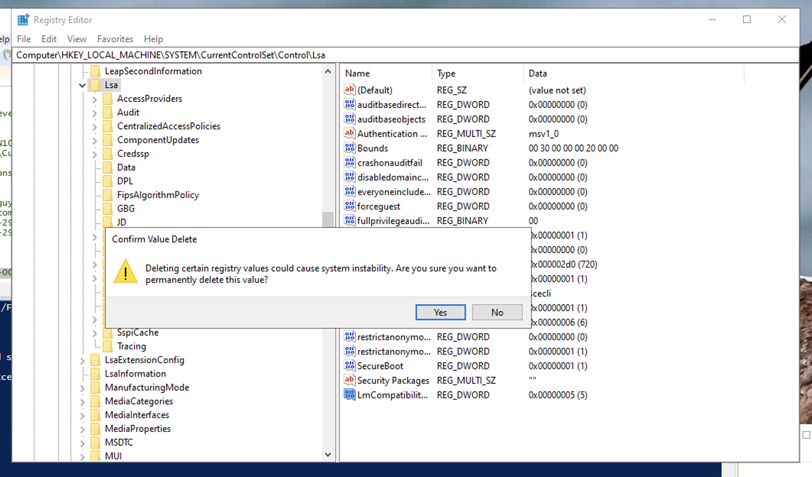
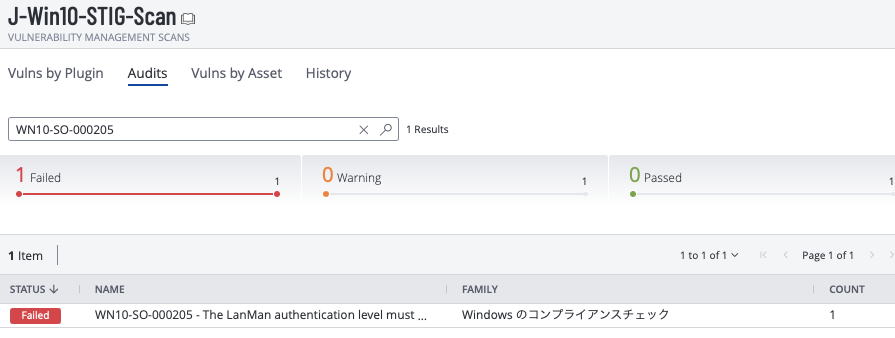
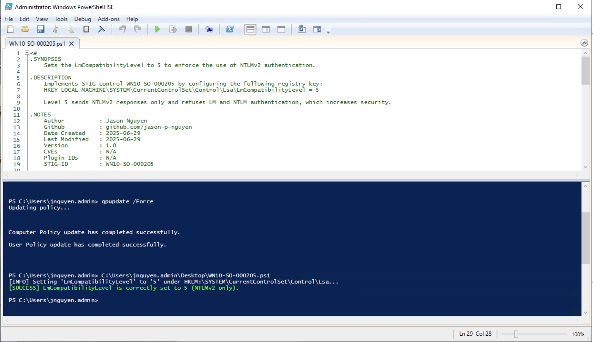
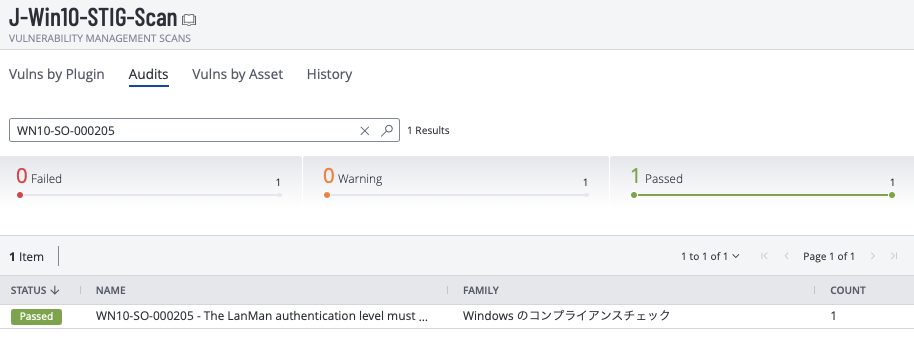

# ✅ STIG Remediation Process: WN10-SO-000205


**STIG ID:** WN10-SO-000205

**Status:** ✅ Completed

## 🧾 Personal Implementation Notes

This document outlines the exact step-by-step process I followed to manually and programmatically remediate STIG **WN10-SO-000205** on a Windows 10 virtual machine. Each stage includes screenshots, testing steps, and a PowerShell script I created to automate the fix.

---

## 🔍 Initial Assessment

* Identified **WN10-SO-000205** as failed in the initial Tenable STIG scan.

* Confirmed the baseline scan used correct DISA STIG benchmark (Windows 10 v3r1).

* **Description:**
  `The system must be configured to require NTLMv2 authentication.`
  This setting strengthens authentication and protects against certain replay and credential forwarding attacks.

* 📸 Screenshot: Initial failed scan result


---

## 🛠 Manual Remediation

* Researched manual fix using:

  * STIG documentation via [STIGAVIEW WN10-SO-000205](https://stigaview.com/products/win10/v3r1/WN10-SO-000205/)

  
  * Registry path:

    ```
    HKEY_LOCAL_MACHINE\SYSTEM\CurrentControlSet\Control\Lsa\
    Value Name: LmCompatibilityLevel
    Value Type: REG_DWORD
    Value: 5
    ```
* Edited the registry manually to set `LmCompatibilityLevel = 5`
* Restarted VM
* Ran `gpupdate /force`
* 📸 Screenshot: Registry fix applied


* 📸 Screenshot: Scan results after manual remediation — **Passed**


> 📝 Noticed that after remediation, parts of the scan report appeared in Japanese. UI language was already set to English. Not resolved, but noted for case documentation.

---

## 🔁 Revert & Recheck

* Deleted the registry key to simulate a noncompliant state
* Restarted VM
* Ran `gpupdate /force`
* 📸 Screenshot: Fix deletion


* 📸 Screenshot: Scan results after reverting — **Failed**

---

## ⚡ PowerShell Remediation

* Developed [PowerShell script](WN10-SO-000205.ps1) to enforce registry setting:

  ```powershell
  # .SYNOPSIS
    # Sets the LmCompatibilityLevel to 5 to enforce the use of NTLMv2 authentication.
  
  # .DESCRIPTION
    # Implements STIG control WN10-SO-000205 by configuring the following registry key:
    # HKEY_LOCAL_MACHINE\SYSTEM\CurrentControlSet\Control\Lsa\LmCompatibilityLevel = 5
  
    # Level 5 sends NTLMv2 responses only and refuses LM and NTLM authentication, which increases security.

  # .USAGE
    # Run this script in an elevated PowerShell session (Run as Administrator)
  
  # ---------------------------------------------

  $regPath = "HKLM:\SYSTEM\CurrentControlSet\Control\Lsa"
  $name = "LmCompatibilityLevel"
  $value = 5

  # Check if key exists
  if (-Not (Test-Path $regPath)) {
      New-Item -Path $regPath -Force | Out-Null
  }

  # Set the value
  Set-ItemProperty -Path $regPath -Name $name -Value $value -Type DWord
  Write-Output "STIG WN10-SO-000205 remediated: LmCompatibilityLevel set to 5"
  ```
  
* See completed Powershell Script here: [WN10-SO-000205.ps1](WN10-SO-000205.ps1)

* Ran the script on VM

* 📸 Screenshot: Script execution


* Restarted VM

* Ran `gpupdate /force`

* 📸 Screenshot: Scan results after PowerShell fix — **Passed**

---

## 📦 Documentation for GitHub

* STIG write-up completed using markdown
* Added PowerShell script with full headers and inline comments
* Uploaded screenshots:

  * Initial failure
  * Manual registry edit
  * Manual success
  * Revert & failure
  * PowerShell remediation
  * Final scan result
* Link to STIG documentation:

  * [DISA STIG Viewer - WN10-SO-000205](https://stigaview.com/products/win10/v3r1/WN10-SO-000205/)
* GitHub README updated
* ✅ Marked complete in internship tracker

---

## 🧠 Reflection

* Small but curious issue: parts of the Tenable report showed up in Japanese even though system UI was English. Might be related to region or scan engine settings.
* This STIG reinforced comfort with registry edits and PowerShell scripting.
* Practiced full remediation lifecycle: identify, fix manually, revert, re-fix with automation.
* ✅ Successfully documented and validated automated remediation — ready for reuse across environments.
